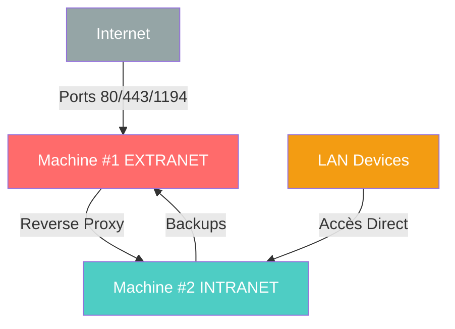

# 🏠 Media Server Home - Infrastructure Homelab

[](LICENSE)
[](https://www.proxmox.com/)
[](https://www.debian.org/)
[](https://docs.docker.com/compose/)

> **Infrastructure de production 24/7** pour auto-hébergement de services familiaux et laboratoire d'apprentissage système/réseau.

---

## 📊 Vue d'Ensemble

**Type :** Homelab 2 machines (EXTRANET/INTRANET séparés)  
**Objectif :** Stockage photos/fichiers famille + VMs laboratoire + apprentissage DevOps  
**Stack :** Proxmox VE + Debian + Docker Compose + ZFS  
**Sécurité :** Architecture DMZ multi-couches

### 🎯 Cas d'Usage Principaux

- ✅ **Stockage photos famille** (Immich) - 4 TB disponible
- ✅ **Partage fichiers** (Nextcloud) - accès web + mobile
- ✅ **VMs laboratoire** (Ubuntu/Debian/Windows) - apprentissage
- ✅ **Monitoring** (Prometheus + Grafana)
- ✅ **Accès distant sécurisé** (OpenVPN)
- ✅ **Backups automatisés** (Restic chiffré)

---

## 🏗️ Architecture

### **Vue d'Ensemble**

```
Internet (WAN)
    ↓
Box Internet (192.168.1.1)
├─ Port forwarding :
│  ├─ 80/443 → Machine #1
│  └─ 1194/udp → Machine #1
│
└─ LAN (192.168.1.0/24)
   │
   ├─ Machine #1 : EXTRANET (DMZ)
   │  ├─ IP : 192.168.1.111
   │  ├─ Rôle : Exposition Internet UNIQUEMENT
   │  ├─ Hardware : Dell OptiPlex 7040 (i5-6500, 16GB RAM)
   │  └─ Services : NPM, OpenVPN, Fail2ban
   │
   └─ Machine #2 : INTRANET (Privé)
      ├─ IP : 192.168.1.101
      ├─ Rôle : Stockage + Services + VMs Lab
      ├─ Hardware : Custom PC (i7-6700, 16GB RAM, GTX 980, 4TB HDD)
      └─ Services : Immich, Nextcloud, VMs dev
```

### **Séparation de Sécurité**



**Principe :** Machine #2 **JAMAIS** exposée directement à Internet.

---

## 🖥️ Matériel

### **Machine #1 : EXTRANET (Dell OptiPlex 7040)**

| Composant | Specs |
|-----------|-------|
| **CPU** | Intel Core i5-6500 (4C/4T @ 3.2-3.6 GHz) |
| **RAM** | 16 GB DDR4-2133 (dual channel) |
| **SSD** | Samsung NVMe 256 GB (Proxmox + VMs) |
| **HDD** | 500 GB SATA (backups Machine #2) |
| **GPU** | Intel HD 530 (iGPU) |
| **Réseau** | Gigabit Ethernet |
| **Alim** | 240W OEM |

### **Machine #2 : INTRANET (Custom Build)**

| Composant | Specs |
|-----------|-------|
| **CPU** | Intel Core i7-6700 (4C/**8T** @ 3.4-4.0 GHz) |
| **RAM** | 16 GB DDR4-2133 (dual channel) |
| **SSD** | Crucial MX500 500 GB (Proxmox + VMs) |
| **HDD** | 4 TB SATA NAS-rated (photos/fichiers) |
| **GPU** | NVIDIA GeForce GTX 980 (4 GB GDDR5) |
| **Réseau** | Gigabit Ethernet |
| **Alim** | 500W+ (requis pour GTX 980) |

---

## 🐳 Services Déployés

### **Machine #1 : EXTRANET**

| Service | Port | Description |
|---------|------|-------------|
| **Nginx Proxy Manager** | 80/443 | Reverse proxy + Let's Encrypt |
| **OpenVPN** | 1194/udp | Accès distant VPN |
| **ddclient** | - | DNS dynamique OVH |
| **Fail2ban** | - | Protection bruteforce |
| **node-exporter** | 9100 | Métriques Prometheus |

### **Machine #2 : INTRANET**

| Service | Port | Description |
|---------|------|-------------|
| **Immich** | 2283 | Gestion photos famille (4 TB) |
| **Nextcloud** | 8080 | Partage fichiers + sync |
| **PostgreSQL** | 5432 | Base de données |
| **Redis** | 6379 | Cache |
| **Prometheus** | 9090 | Collecte métriques |
| **Grafana** | 3000 | Dashboards monitoring |
| **VM-DEV-LINUX** | - | Laboratoire Ubuntu/Debian |
| **VM-DEV-WINDOWS** | - | Laboratoire Windows 10/11 |

---

## 🚀 Quick Start

### **Prérequis**

- 2 machines physiques (specs ci-dessus)
- Disque 4 TB NAS-rated pour Machine #2
- Domaine public (ex: `elmzn.be` via OVH)
- Accès SSH aux 2 machines
- Connaissances Linux de base

### **Installation Rapide**

```bash
# 1. Cloner le repo
git clone https://github.com/TON_USER/media-server-home.git
cd media-server-home

# 2. Suivre les guides d'installation
# - docs/SETUP-MACHINE1.md (EXTRANET)
# - docs/SETUP-MACHINE2.md (INTRANET)

# 3. Déployer services
cd configs/machine1-extranet
docker-compose up -d

cd configs/machine2-intranet
docker-compose up -d
```

---

## 📖 Documentation

### **Guides d'Installation**

- 🚀 [**SETUP-MACHINE1.md**](docs/SETUP-MACHINE1.md) - Configuration EXTRANET (DMZ)
- 🚀 [**SETUP-MACHINE2.md**](docs/SETUP-MACHINE2.md) - Configuration INTRANET (Stockage + VMs)
- 🔄 [**MIGRATION-GUIDE.md**](docs/MIGRATION-GUIDE.md) - Migration depuis architecture 1 machine

### **Documentation Technique**

- 📐 [**ARCHITECTURE.md**](docs/ARCHITECTURE.md) - Architecture détaillée + schémas
- 🔒 [**SECURITY.md**](docs/SECURITY.md) - Politique sécurité multi-couches
- 📊 [**OPERATIONS.md**](docs/OPERATIONS.md) - Runbooks maintenance
- 📝 [**ADR/**](docs/ADR/) - Architecture Decision Records

### **Opérations Courantes**

```bash
# Démarrer/Arrêter services
docker-compose up -d    # Démarrer
docker-compose down     # Arrêter
docker-compose logs -f  # Voir logs

# Backups
./scripts/backup-m2-to-m1.sh  # Backup Machine #2 → Machine #1

# VMs laboratoire (Machine #2)
qm start 201   # Démarrer VM-DEV-LINUX
qm stop 201    # Arrêter VM-DEV-LINUX
qm start 202   # Démarrer VM-DEV-WINDOWS
```

---

## 🔒 Sécurité

### **Architecture Defense in Depth (6 couches)**

1. **Box Firewall** - Ports 80/443/1194 UNIQUEMENT vers Machine #1
2. **Proxmox Firewall** - Règles datacenter + VM + node
3. **UFW Machine #1** - Allow public ports, proxy vers Machine #2
4. **UFW Machine #2** - Allow depuis Machine #1 + LAN ONLY, deny Internet
5. **Fail2ban** - Auto-ban bruteforce (3 tentatives = ban 1h)
6. **Application Auth** - Comptes utilisateurs + 2FA (recommandé)

### **Principe Zéro Trust**

- ❌ Machine #2 **JAMAIS** exposée directement Internet
- ✅ Accès externe via reverse proxy (Machine #1) ou VPN uniquement
- ✅ Monitoring actif (Uptime Kuma + Grafana alerting)

---

## 💾 Backups

### **Stratégie 3-2-1**

```
3 Copies des données :
├─ Machine #2 (production) : 4 TB HDD
├─ Machine #1 (backup local) : 500 GB HDD
└─ Cloud offsite (futur) : Backblaze B2

2 Types de médias :
├─ SSD (configs, VMs)
└─ HDD (photos, fichiers)

1 Copie hors-site :
└─ Cloud chiffré (à implémenter)
```

### **Automatisation**

- **Quotidien** : Configs Docker, base de données PostgreSQL
- **Hebdomadaire** : Photos Immich (incrémental)
- **Mensuel** : Fichiers Nextcloud complets
- **Rétention** : 7 daily, 4 weekly, 6 monthly

```bash
# Restaurer backup
restic restore latest --target /restore --tag photos
```

---

## 📊 Monitoring

### **Dashboards Grafana**

- **Node Exporter Full** (CPU, RAM, Disk, Network)
- **Docker Monitoring** (Containers, Images, Volumes)
- **ZFS Metrics** (Pool health, I/O stats)
- **Custom Dashboard** (Services uptime, response times)

### **Alerting**

- Disk usage > 80%
- Service down > 5 min
- RAM usage > 90%
- Backup failed

---

## 🎯 Décisions Techniques Clés (ADR)

| # | Décision | Choix | Raison |
|---|----------|-------|--------|
| 011 | Architecture | **2 machines séparées** | Sécurité + performance + apprentissage |
| 012 | Séparation | **EXTRANET/INTRANET** | Isolation DMZ, réduction surface d'attaque |
| 013 | Stockage | **ZFS sur 4 TB HDD** | Intégrité données, snapshots, quotas |
| 014 | VMs Lab | **On-demand** | Économise RAM (16 GB limité Machine #2) |
| 015 | Backups | **Restic M2→M1** | Chiffré, incrémental, efficace |

Voir [docs/ADR/](docs/ADR/) pour détails complets.

---

## 📈 Roadmap

### **Court Terme (0-3 mois)**

- [x] Architecture 2 machines opérationnelle
- [x] Immich + Nextcloud déployés
- [x] VMs laboratoire configurées
- [ ] Backups offsite (Backblaze B2)
- [ ] Alerting Grafana configuré
- [ ] Screenshots UI (portfolio)

### **Moyen Terme (3-6 mois)**

- [ ] Upgrade RAM Machine #2 (16 GB → 32 GB) si besoin
- [ ] Ajout Node #3 (cluster Proxmox HA) - optionnel
- [ ] Migration Jellyfin (streaming vidéo) si usage famille
- [ ] Cloudflare Tunnel (alternative OpenVPN)

### **Long Terme (6-12 mois)**

- [ ] Kubernetes (k3s) pour orchestration services
- [ ] CI/CD pipeline (GitLab Runner auto-hébergé)
- [ ] Monitoring avancé (Loki + Tempo)

---

## 🤝 Contribution

Ce projet est principalement **éducatif** et **personnel**, mais suggestions/questions bienvenues !

### **Comment Contribuer**

1. Fork le projet
2. Créer branche feature (`git checkout -b feature/amelioration`)
3. Commit changements (`git commit -m 'Add: nouvelle feature'`)
4. Push branche (`git push origin feature/amelioration`)
5. Ouvrir Pull Request

---

## 📞 Ressources & Liens

### **Documentation Officielle**

- [Proxmox VE](https://pve.proxmox.com/wiki/)
- [Docker Compose](https://docs.docker.com/compose/)
- [Immich](https://immich.app/docs/)
- [Nextcloud](https://docs.nextcloud.com/)
- [Nginx Proxy Manager](https://nginxproxymanager.com/)

### **Communauté**

- [r/selfhosted](https://reddit.com/r/selfhosted)
- [r/Proxmox](https://reddit.com/r/Proxmox)
- [r/homelab](https://reddit.com/r/homelab)

---

## 📜 License

Ce projet est sous licence **MIT** - voir [LICENSE](LICENSE) pour détails.

---

## 🙏 Remerciements

- Communauté r/selfhosted pour inspiration
- Projet Immich pour excellent logiciel photos
- Proxmox team pour hyperviseur open-source
- Tous les mainteneurs de logiciels open-source utilisés

---

**Dernière mise à jour :** 2025-11-28  
**Version architecture :** 2.0 (2 machines EXTRANET/INTRANET)

---

<div align="center">
  <b>Made with ❤️ for learning and family</b>
</div>
