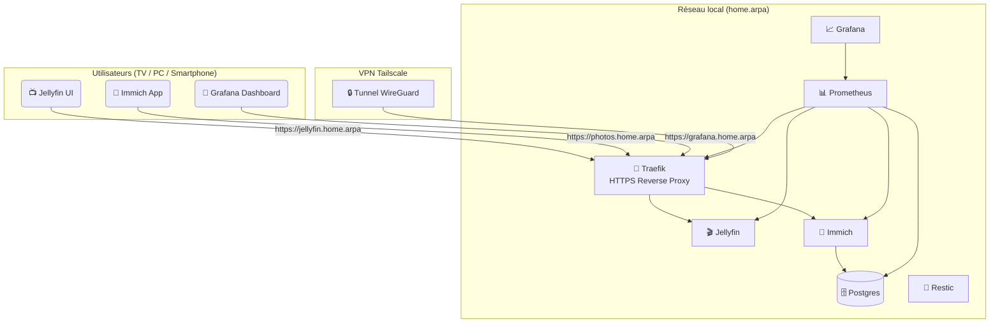

# 🏗️ Architecture — Projet *media-server-home*

## 📘 Contexte général

Le projet **media-server-home** est un serveur multimédia domestique **auto-hébergé**, destiné à stocker, diffuser et sauvegarder les contenus multimédias (photos, vidéos) pour les membres du foyer.  

Le système est conçu pour fonctionner 24/7 sur une **machine physique Dell Optiplex 7040 (i5-6500, 8–16 Go RAM)**, avec :
- un **hyperviseur Proxmox VE 8**,  
- une **VM Ubuntu Server 24.04 “Services”**,  
- et un ensemble de **conteneurs Docker** orchestrés via `docker-compose`.

---

## ⚙️ Vue d’ensemble

+----------------------------------------------------+

| Proxmox VE 8                                           |
| ------------------------------------------------------ |
| VM "Services" (Ubuntu Server 24.04)                    |
| - Docker Compose                                       |
| - Stack : Jellyfin / Immich / Traefik / Restic         |
| - Monitoring : Prometheus + Grafana                    |
| - VPN : Tailscale                                      |
| ----------------------------------------------------   |
| Pool ZFS : tank                                        |
| ├─ tank/media     → vidéos, films, séries              |
| ├─ tank/photos    → bibliothèque Immich                |
| ├─ tank/appdata   → données conteneurs Docker          |
| └─ tank/backups   → sauvegardes Restic                 |
| +----------------------------------------------------+ |

---

## 🧱 Couches d’infrastructure

| Couche | Description | Technologies |
|---------|--------------|---------------|
| **Hôte physique** | Machine Dell Optiplex 7040 | Intel i5-6500 + SSD NVMe + HDD |
| **Hyperviseur** | Plateforme de virtualisation | **Proxmox VE 8** |
| **VM principale** | Ubuntu 24.04 LTS “Services” | **Docker + Compose** |
| **Orchestration** | Gestion des conteneurs | Docker Compose (profiles, Makefile) |
| **Stockage** | Intégrité & snapshots | **ZFS** (pool `tank`) |
| **Sauvegarde** | Incrémentale chiffrée | **Restic** |
| **Reverse Proxy** | Routage HTTPS et sécurité | **Traefik** |
| **Monitoring** | Supervision & dashboards | **Prometheus + Grafana** |
| **VPN distant** | Accès privé | **Tailscale (WireGuard)** |

---

## 🌐 Réseau et flux de communication

## 🔌 Liste des services et ports
  | Service                    | Port Interne         | Port Externe   | Protocole | Description                          |
| -------------------------- | -------------------- | -------------- | --------- | ------------------------------------ |
| **Traefik**                | 80 / 443             | 80 / 443       | TCP       | Reverse proxy HTTPS (public interne) |
| **Jellyfin**               | 8096                 | —              | TCP       | Streaming multimédia                 |
| **Immich (API)**           | 2283                 | —              | TCP       | Serveur web Immich                   |
| **Immich (Microservices)** | 3001                 | —              | TCP       | Services de traitement d’image       |
| **Postgres (Immich DB)**   | 5432                 | —              | TCP       | Base de données Immich               |
| **Prometheus**             | 9090                 | —              | TCP       | Collecte des métriques               |
| **Grafana**                | 3000                 | —              | TCP       | Visualisation et dashboards          |
| **Restic / Backup**        | —                    | —              | CLI       | Sauvegardes locales/distantes        |
| **Tailscale (VPN)**        | 41641 (UDP)          | —              | UDP       | Accès distant chiffré                |
| **SSH (VM)**               | 22 (ou personnalisé) | LAN uniquement | TCP       | Administration serveur               |

## 🗂️ Volumes et datasets (ZFS)
| Dataset        | Point de montage    | Usage principal          | Sauvegarde       |
| -------------- | ------------------- | ------------------------ | ---------------- |
| `tank/media`   | `/mnt/tank/media`   | Fichiers vidéo Jellyfin  | Hebdomadaire     |
| `tank/photos`  | `/mnt/tank/photos`  | Bibliothèque Immich      | Hebdomadaire     |
| `tank/appdata` | `/mnt/tank/appdata` | Configs Docker, DB, logs | Quotidienne      |
| `tank/backups` | `/mnt/tank/backups` | Dépôt Restic, snapshots  | Auto-quotidienne |

## 🔒 Sécurité intégrée (récapitulatif)

| Domaine                  | Mesure de protection                                    |
| ------------------------ | ------------------------------------------------------- |
| **Accès distant**        | VPN Tailscale (WireGuard)                               |
| **HTTPS**                | Traefik + certificats Let’s Encrypt / self-signed       |
| **Sauvegardes**          | Restic chiffré (AES-256)                                |
| **Système**              | SSH par clé, UFW + Fail2ban                             |
| **Snapshots**            | ZFS automatiques                                        |
| **Logs & monitoring**    | Prometheus + Grafana                                    |
| **Comptes utilisateurs** | Gestion locale (Jellyfin / Immich), mots de passe forts |
| **Pare-feu Proxmox**     | Ports restreints aux VMs autorisées                     |

## 🧩 Détails des interactions clés
### 🔁 Flux de données

1. Traefik reçoit les requêtes HTTPS et les redirige vers le bon service (basé sur le domaine).
2. Jellyfin diffuse les vidéos depuis tank/media.
3. Immich indexe et affiche les photos depuis tank/photos.
4. Postgres stocke les métadonnées (albums, tags, utilisateurs).
5. Restic sauvegarde les datasets et les dumps Postgres.
6. Prometheus collecte les métriques système et conteneurs, consultées via Grafana.

## 📊 Performances et contraintes

| Ressource    | Recommandation            | Justification                  |
| ------------ | ------------------------- | ------------------------------ |
| **CPU**      | 4 cœurs                   | Transcodage + VM + Docker      |
| **RAM**      | 8–16 Go                   | ZFS + conteneurs + cache média |
| **Stockage** | SSD OS + HDD ZFS (≥ 1 To) | Séparation OS / données        |
| **Réseau**   | Gigabit LAN               | Streaming local fluide         |
| **GPU**      | Intel HD 530 (QuickSync)  | Transcodage matériel Jellyfin  |

## 🔁 Évolutivité

| Composant       | Évolution possible                                   |
| --------------- | ---------------------------------------------------- |
| **VM Services** | Augmentation RAM / CPU via Proxmox                   |
| **Stockage**    | Extension pool ZFS (disques miroir)                  |
| **Sauvegardes** | Ajout backend S3 (Restic)                            |
| **Monitoring**  | Intégration Loki / Promtail (logs centralisés)       |
| **Infra**       | Migration LXC ou Kubernetes (stack Docker modulaire) |

## 🔮 Prochaines action

- [ ] Finaliser le docker-compose.yml (IA DEV).
- [ ] Créer le schéma “architecture réseau” dans /assets/architecture/architecture.mmd.
- [ ] Documenter les ports et DNS internes dans le Wiki.
- [ ] Effectuer une revue complète de la sécurité et des performances avant déploiement (pré-prod).

🗓️ **Journal de bord Future desicion**

- Document : ARCHITECTURE.md finalisé.
- Couvre : couches infra, flux réseau, ports, datasets, sécurité et performances.
- Étape suivante : validation complète de la phase “théorie” avant passage à la phase “implémentation” (IA DEV).

---

### 💡 Résumé pour ton Wiki
> **ARCHITECTURE.md — Vue d’ensemble du système**  
> - Hôte : Proxmox VE 8, VM Ubuntu “Services”  
> - Orchestration : Docker Compose + Traefik  
> - Stockage : ZFS (datasets `media`, `photos`, `appdata`, `backups`)  
> - Sauvegardes : Restic (chiffrées, locales + externes)  
> - Monitoring : Prometheus + Grafana  
> - Accès : HTTPS interne + VPN Tailscale  
