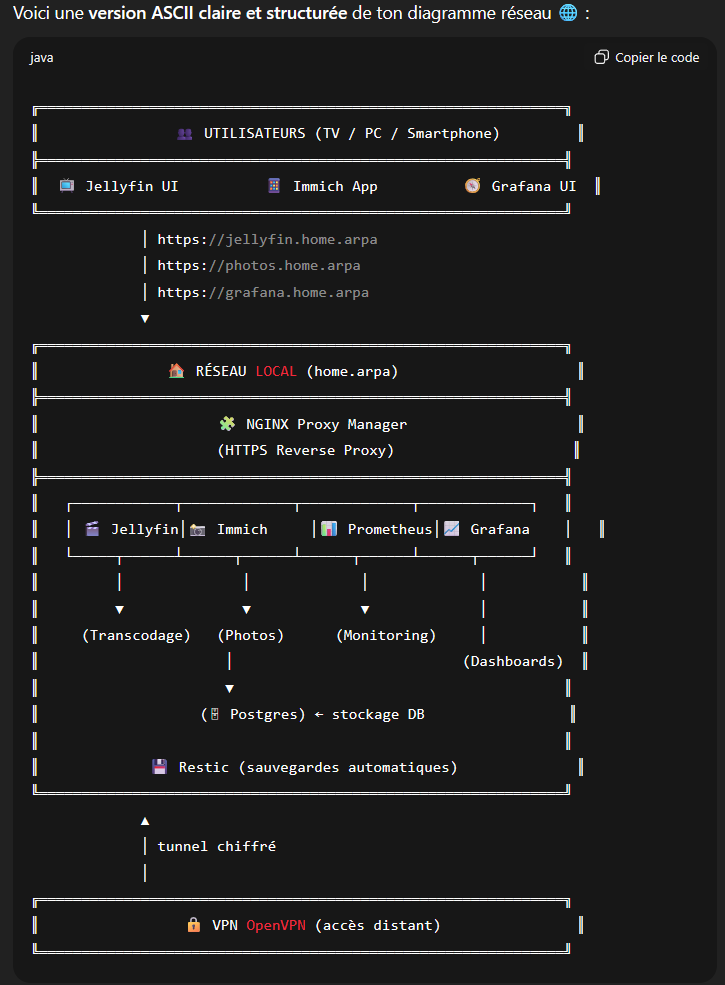

# 🏗️ Architecture — Projet *media-server-home*

## 📘 Contexte général

Le projet **media-server-home** est un serveur multimédia domestique **auto-hébergé**, destiné à stocker, diffuser et sauvegarder les contenus multimédias (photos, vidéos) pour les membres du foyer.  

Le système est conçu pour fonctionner 24/7 sur une **machine physique Dell Optiplex 7040 (i5-6500, 8–16 Go RAM)**, avec :
- un **hyperviseur Proxmox VE 8**,  
- une **VM Debian 13 “Services”**,  
- et un ensemble de **conteneurs Docker** orchestrés via `docker-compose`.

---

## ⚙️ Vue d’ensemble

```md

+----------------------------------------------------+

| Proxmox VE 8                                           |
| ------------------------------------------------------ |
| VM "Services" (Debian 13)                              |
| - Docker Compose                                       |
| - Stack : Jellyfin / Immich / NPM / Restic             |
| - Monitoring : Prometheus + Grafana                    |
| - VPN : OpenVPN                                        |
| ----------------------------------------------------   |
| Pool ZFS : tank                                        |
| ├─ tank/media     → vidéos, films, séries              |
| ├─ tank/photos    → bibliothèque Immich                |
| ├─ tank/appdata   → données conteneurs Docker          |
| └─ tank/backups   → sauvegardes Restic                 |
| +----------------------------------------------------+ |

```

---

## 🧱 Couches d’infrastructure

| Couche | Description | Technologies |
|---------|--------------|---------------|
| **Hôte physique** | Machine Dell Optiplex 7040 | Intel i5-6500 + SSD NVMe + HDD |
| **Hyperviseur** | Plateforme de virtualisation | **Proxmox VE 8** |
| **VM principale** | Debian 13 “Services” | **Docker + Compose** |
| **Orchestration** | Gestion des conteneurs | Docker Compose (profiles, Makefile) |
| **Stockage** | Intégrité & snapshots | **ZFS** (pool `tank`) |
| **Sauvegarde** | Incrémentale chiffrée | **Restic** |
| **Reverse Proxy** | Routage HTTPS et sécurité | **Nginx Proxy Manager (NPM)** *(Traefik en option)* |
| **Monitoring** | Supervision & dashboards | **Prometheus + Grafana** |
| **VPN distant** | Accès privé | **OpenVPN** |

---

## 🌐 Réseau et flux de communication

---

## 🔌 Liste des services et ports

| Service                       | Port Interne         | Port Externe   | Protocole | Description                   |
| ----------------------------- | -------------------- | -------------- | --------- | ----------------------------- |
| **Nginx Proxy Manager (NPM)** | 80 / 443             | 80 / 443       | TCP       | Reverse proxy HTTPS (LAN)     |
| **Jellyfin**                  | 8096                 | —              | TCP       | Streaming multimédia          |
| **Immich (API)**              | 2283                 | —              | TCP       | Serveur web Immich            |
| **Immich (Microservices)**    | 3001                 | —              | TCP       | Traitement d’image            |
| **Postgres (Immich DB)**      | 5432                 | —              | TCP       | Base de données Immich        |
| **Prometheus**                | 9090                 | —              | TCP       | Collecte des métriques        |
| **Grafana**                   | 3000                 | —              | TCP       | Visualisation et dashboards   |
| **Restic / Backup**           | —                    | —              | CLI       | Sauvegardes locales/distantes |
| **OpenVPN**                   | 1194 (UDP)           | 1194           | UDP       | Accès distant chiffré         |
| **SSH (VM)**                  | 22 (ou personnalisé) | LAN uniquement | TCP       | Administration serveur        |

> ⚠️ Aucun service n’est exposé publiquement.
> L’accès distant se fait **exclusivement via OpenVPN**.

---

## 🗂️ Volumes et datasets (ZFS)

| Dataset        | Point de montage    | Usage principal          | Sauvegarde       |
| -------------- | ------------------- | ------------------------ | ---------------- |
| `tank/media`   | `/mnt/tank/media`   | Fichiers vidéo Jellyfin  | Hebdomadaire     |
| `tank/photos`  | `/mnt/tank/photos`  | Bibliothèque Immich      | Hebdomadaire     |
| `tank/appdata` | `/mnt/tank/appdata` | Configs Docker, DB, logs | Quotidienne      |
| `tank/backups` | `/mnt/tank/backups` | Dépôt Restic, snapshots  | Auto-quotidienne |

---

## 🔒 Sécurité intégrée (récapitulatif)

| Domaine                  | Mesure de protection                            |
| ------------------------ | ----------------------------------------------- |
| **Accès distant**        | VPN OpenVPN (chiffrement AES-256-CBC)           |
| **HTTPS**                | Nginx Proxy Manager (certificats Let’s Encrypt) |
| **Sauvegardes**          | Restic chiffré (AES-256)                        |
| **Système**              | SSH par clé, UFW + Fail2ban                     |
| **Snapshots**            | ZFS automatiques                                |
| **Logs & monitoring**    | Prometheus + Grafana                            |
| **Comptes utilisateurs** | Authentification locale (Jellyfin / Immich)     |
| **Pare-feu Proxmox**     | Ports restreints aux VMs autorisées             |

---

## 🧩 Détails des interactions clés

1. Nginx Proxy Manager reçoit les requêtes HTTPS et redirige vers le bon service interne.
2. Jellyfin diffuse les vidéos depuis `tank/media`.
3. Immich gère et affiche les photos depuis `tank/photos`.
4. Postgres stocke les métadonnées utilisateurs et albums.
5. Restic sauvegarde les datasets et dumps Postgres.
6. Prometheus collecte les métriques du système et des conteneurs, visualisées dans Grafana.
7. OpenVPN assure l’accès distant chiffré depuis l’extérieur.

---

## 📊 Performances et contraintes

| Ressource    | Recommandation            | Justification                  |
| ------------ | ------------------------- | ------------------------------ |
| **CPU**      | 4 cœurs                   | Transcodage + VM + Docker      |
| **RAM**      | 8–16 Go                   | ZFS + conteneurs + cache média |
| **Stockage** | SSD OS + HDD ZFS (≥ 1 To) | Séparation OS / données        |
| **Réseau**   | Gigabit LAN               | Streaming local fluide         |
| **GPU**      | Intel HD 530 (QuickSync)  | Transcodage matériel Jellyfin  |

---

## 🔁 Évolutivité

| Composant         | Évolution possible                                                       |
| ----------------- | ------------------------------------------------------------------------ |
| **VM Services**   | Passage à Ubuntu ou ajout RAM/CPU                                        |
| **Stockage**      | Extension pool ZFS (RAID 1 / miroir)                                     |
| **Sauvegardes**   | Ajout backend S3 (Restic)                                                |
| **Reverse Proxy** | Possibilité de migrer vers **Traefik** pour automatisation labels Docker |
| **Monitoring**    | Intégration Loki / Promtail (logs centralisés)                           |

---

## 🔮 Prochaines actions

* [ ] Adapter le `docker-compose.yml` à Debian.
* [ ] Créer le schéma “architecture réseau” dans `/assets/architecture/architecture.mmd`.
* [ ] Documenter la configuration OpenVPN dans `/infra/vm/services-ubuntu.md`.
* [ ] Tester la compatibilité GPU QuickSync sur Debian.
* [ ] Évaluer le maintien ou la migration vers **Traefik** si nécessaire.

---


## 🧱 Topologie logique — Multi-VM (Intranet / Extranet)

```java

+---------------------------------------------------------------+
|                         Proxmox VE 8                          |
|  Bridges réseau :  vmbr0 (LAN/INTRANET)  |  vmbr1 (DMZ/EXTRANET) |
+----------------------+-------------------+--------------------+
|                                       |
+----------+-----------+                 +---------+----------+
|  VM-INTRANET         |                 |  VM-EXTRANET       |
|  Debian 12           |                 |  Debian 12         |
|  (LAN : vmbr0)       |                 |  (DMZ : vmbr1)     |
+----------------------+                 +--------------------+
| Docker Compose       |                 | Docker Compose     |
| - Jellyfin           |                 | - Nginx Proxy Mgr  |
| - Immich (+ Postgres)|                 | - OpenVPN          |
| - Prometheus + Graf. |                 | - node_exporter    |
| - Restic             |                 |                    |
|                      |                 |                    |
| ZFS (tank):          |                 | (AUCUN accès ZFS)  |
| - /media  /photos    |                 |                    |
| - /appdata /backups  |                 |                    |
+----------+-----------+                 +----------+---------+
^                                       |
| (HTTP(S) backends)                    | (HTTPS + VPN)
+------------------- Proxy  ------------+

```

---

## 🌐 Réseau & flux entre VMs

- **Bridges Proxmox**
  - `vmbr0` → **INTRANET (LAN)** : VM-INTRANET
  - `vmbr1` → **EXTRANET (DMZ)** : VM-EXTRANET
- **DNS interne** : `*.home.arpa`
- **Routage** : pare-feu **Proxmox** activé (niveau Datacenter/Node/VM) + **UFW** dans chaque VM.

### 🔐 Matrice de flux autorisés

| Source → Cible          | Ports                      | Raison |
|-------------------------|----------------------------|--------|
| **Clients LAN → EXTRANET** | 443/TCP, 80/TCP (option LAN), 1194/UDP | Accès HTTPS via NPM, tunnel OpenVPN |
| **EXTRANET → INTRANET** | 8096/TCP (Jellyfin), 2283/TCP & 3001/TCP (Immich), 9090/TCP (Prometheus metrics, si scrape depuis DMZ), 3000/TCP (Grafana – option, restreint) | Proxy vers backends + supervision |
| **INTRANET → EXTRANET** | 443/TCP (ACME/MAJ certs), 53/DNS (si nécessaire), 25/587 SMTP (alertes – option) | Sortants contrôlés |
| **INTRANET ↔ Internet** | **Sortants uniquement** (apt, images Docker) | Aucune entrée directe |

> 💡 Recommandation : **ne pas** exposer Postgres (5432) en inter-VM ; tout le trafic Immich passe par l’API HTTP(s).

---

## 🔌 Services par VM (ports internes)

### VM-EXTRANET (DMZ) — **Nginx Proxy Manager & VPN**
| Service                 | Port(s)     | Notes |
|-------------------------|-------------|-------|
| **Nginx Proxy Manager** | 80, 443     | Terminaison HTTPS, proxy vers INTRANET |
| **OpenVPN**             | 1194/UDP    | Accès distant chiffré |
| **node_exporter**       | 9100 (LAN)  | Scrapé par Prometheus (depuis INTRANET) |

### VM-INTRANET (LAN) — **Backends & Données**
| Service                          | Port(s)   | Notes |
|----------------------------------|-----------|-------|
| **Jellyfin**                     | 8096      | Non exposé ; accessible via NPM |
| **Immich (API + microservices)** | 2283, 3001| Non exposé ; via NPM |
| **Postgres (Immich)**            | 5432 (local) | **Local only** (loopback/bridge interne) |
| **Prometheus**                   | 9090      | Scrape `node_exporter` (INTRANET+EXTRANET) |
| **Grafana**                      | 3000      | Option : accès via NPM avec ACL stricte |
| **Restic**                       | —         | Sauvegardes ZFS chiffrées |

---

## 🗂️ Stockage ZFS (VM-INTRANET uniquement)

| Dataset         | Mountpoint          | Usage |
|-----------------|---------------------|-------|
| `tank/media`    | `/mnt/tank/media`   | Vidéos Jellyfin |
| `tank/photos`   | `/mnt/tank/photos`  | Bibliothèque Immich |
| `tank/appdata`  | `/mnt/tank/appdata` | Configs Docker, DB, logs |
| `tank/backups`  | `/mnt/tank/backups` | Dépôt Restic, snapshots |

> 🔒 **Aucun mount ZFS** sur la VM-EXTRANET.

---

## 🧯 Règles pare-feu (résumé)

- **Proxmox Firewall** :  
  - Datacenter & Node activés.  
  - VM-EXTRANET : autoriser **443/TCP**, **80/TCP** (LAN si besoin), **1194/UDP**, **9100/TCP** (depuis INTRANET).  
  - VM-INTRANET : autoriser **depuis EXTRANET** → 8096, 2283, 3001, 9090 (et 3000 si Grafana via NPM).
- **UFW (dans chaque VM)** : par défaut **deny incoming**, autoriser uniquement la matrice ci-dessus.

---

## 🧩 Notes d’exploitation

- **Supervision** : Prometheus (INTRANET) **scrape** `node_exporter` des deux VMs ; exporter NPM si dispo.  
- **Sauvegardes** : Restic sur INTRANET (inclut `/appdata`, dumps DB, configs NPM exportées).  
- **Restauration** : Remonter EXTRANET (NPM/OpenVPN) en premier, puis INTRANET (DB/Immich/Jellyfin).


